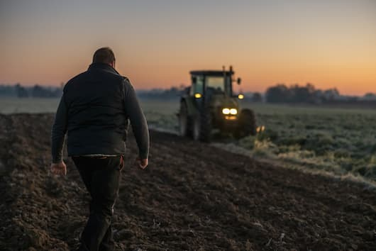

# Sowing Success: Predictive Modeling for Agriculture 🌾



## 🎯 Goal

This project explores how machine learning can be used to help farmers make data-driven decisions about which crops to plant. By analyzing soil metrics, we can predict the optimal crop for a given field, maximizing yield and promoting sustainable agriculture.

## 💾 The Data

The analysis is based on the `soil_measures.csv` dataset, which contains the following information for various fields:

* **"N"**: Nitrogen content ratio in the soil
* **"P"**: Phosphorous content ratio in the soil
* **"K"**: Potassium content ratio in the soil
* **"ph"**: pH value of the soil
* **"crop"**: The optimal crop for the given soil conditions (our target variable)

## 🤖 The Model

A **Logistic Regression** model, a type of multi-class classification algorithm, was used for this project. The model was trained on the dataset to learn the relationship between the soil metrics and the optimal crop.

To identify the most influential factor, the model was trained and evaluated on each feature individually ("N", "P", "K", and "ph").

## ✨ Results

The analysis revealed that **Potassium ("K")** is the single most important feature for predicting the best crop to plant, achieving the highest accuracy score when used alone.

## 🚀 How to Use

To run this project yourself, you'll need Python and the following libraries:

* pandas
* scikit-learn

You can install them using pip:

```bash
pip install pandas scikit-learn
